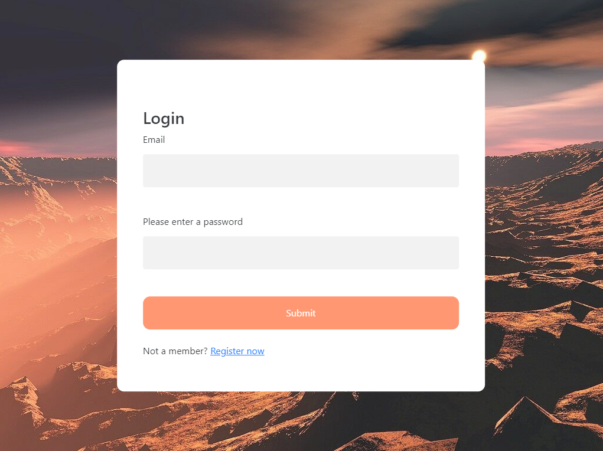
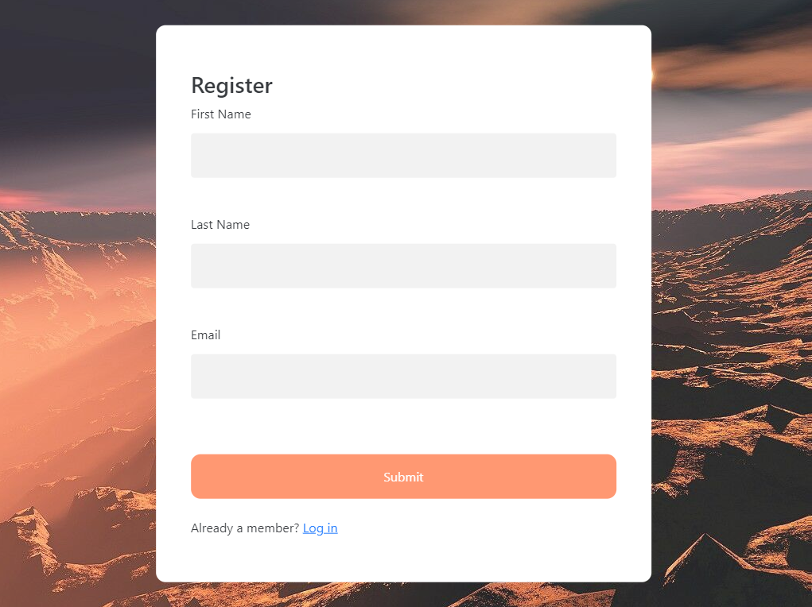
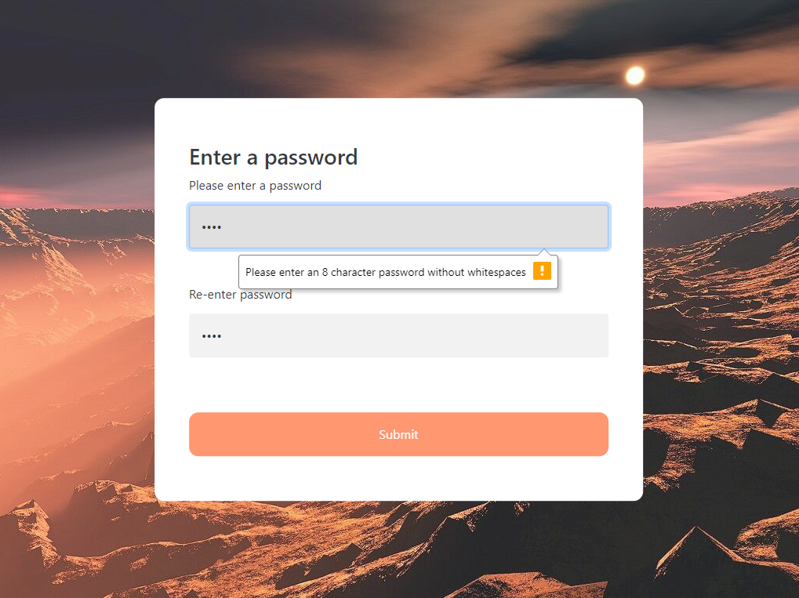
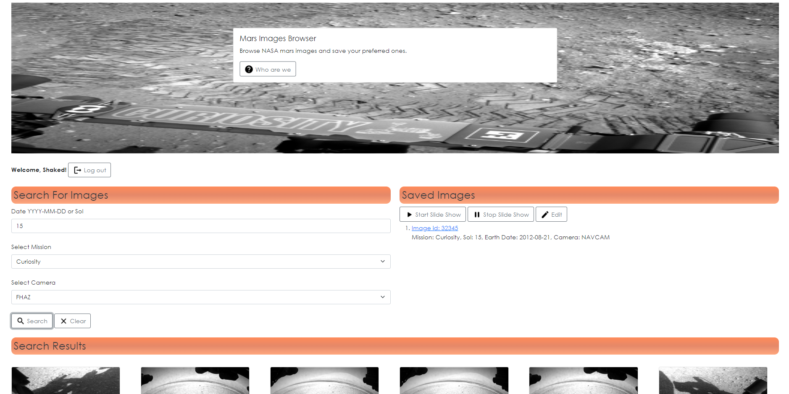

# NASA Mars Images

Responsive website where you can browse NASA mars images and save your preferred ones - Now with the ability to register a new account,
and login from everywhere to see your saved images!

This is an expansion to the [Mars Images Project](https://github.com/shakedva/Mars-Images-Page).

## Technologies:
* Node.js Express
* SQLite

## Authors

* [Shaked Vaknin](https://github.com/shakedva)
* [Noy Tal Gelfand](https://github.com/noytal1)

## Screenshots

